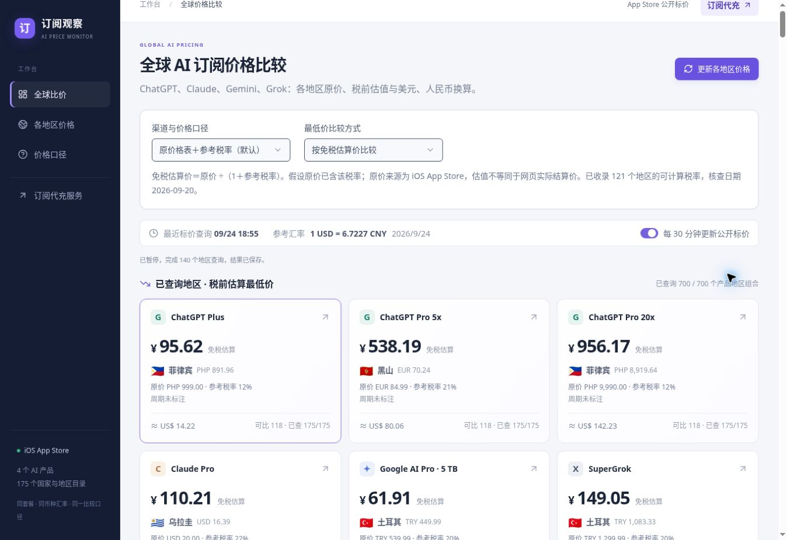

# AI Subscription Prices

Compare public regional subscription listings for **ChatGPT, Claude, Gemini and Grok**, with local currency, USD/CNY conversion and estimated tax-exclusive prices.

**[Open the price comparison tool](https://ai-pricing-live.gptpro200x.chatgpt.site/?utm_source=github&utm_medium=readme_en&utm_campaign=ai-subscription-prices)** · [简体中文](README.md)



Live website captured on 2026-09-24. Figures are observations at capture time, not a current quotation.

## Features

- Regional in-app purchase prices from public Apple App Store pages.
- Product, plan and region filters with source links and observation times.
- USD and CNY conversion using ExchangeRate-API reference rates.
- Reference tax rates and explicitly labelled tax-exclusive estimates.
- D1 caching, refresh cooldowns and upstream rate-limit handling.
- Optional refresh every 30 minutes while the page is open.

App Store listings are not website checkout quotes. Rankings use eligible observed data, not every possible final purchase price. An anonymized historical checkout example is displayed separately and excluded from current rankings. Price history charts and unattended scheduled collection are not implemented.

## Run locally

Use Node.js >=22.13 and pnpm 11.25.0:

```bash
pnpm install --frozen-lockfile
pnpm db:migrate:local
pnpm dev
```

Open http://127.0.0.1:5173 . The local D1 emulator needs no Cloudflare login. A new database has no regional price cache; unavailable sources remain unavailable rather than being filled with synthetic prices.

```bash
pnpm test
pnpm build
```

Production requires Cloudflare Workers and D1. See [deployment instructions](docs/DEPLOYMENT.md). The complete application cannot run on GitHub Pages.

## Maintainer service

The maintainer, TYSJY, also operates [gptpro20.com subscription assistance](https://gptpro20.com/?utm_source=github&utm_medium=readme_en&utm_campaign=ai-subscription-prices&utm_content=service), a separate commercial service. The comparison tool is independently usable. Listed regional prices are not service quotations. Neither this project nor the service represents official authorization by the named AI providers.

## Sources and contributions

Public listings: [Apple App Store](https://apps.apple.com/). Reference FX: [ExchangeRate-API](https://www.exchangerate-api.com/). Tax assumptions and citations are recorded alongside the data; see [data methodology](docs/DATA-SOURCES.md).

Use the issue templates to report reproducible problems and source-backed corrections. Never submit credentials, sessions, cookies or private payment records.

Code: [MIT](LICENSE). See [third-party notices](THIRD_PARTY_NOTICES.md). External data and trademarks remain subject to their respective rights.
